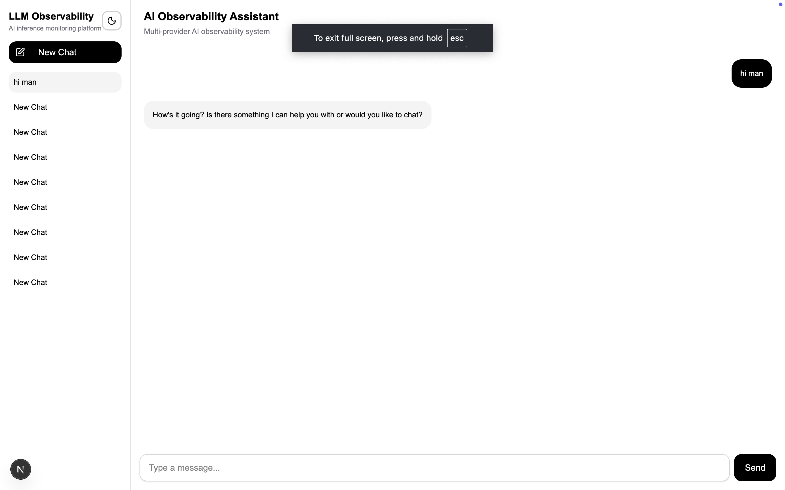
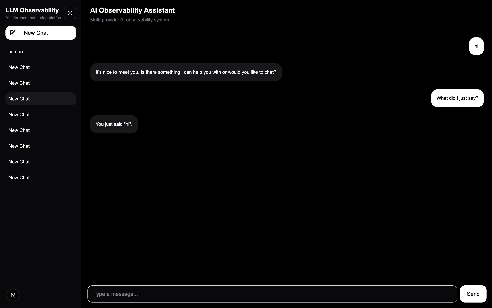
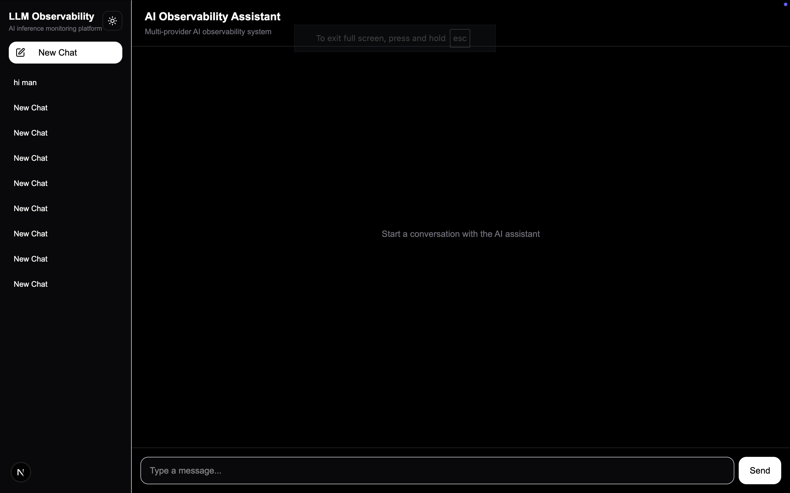

# LLM Observability Platform

A lightweight AI inference logging and observability platform built with Next.js, Prisma, PostgreSQL, and multi-provider LLM integrations.

The system captures and stores inference metadata from LLM requests in near real-time while providing a modern ChatGPT-style conversational interface.

---

# Features

## Chatbot Application

- Multi-turn AI conversations
- Persistent conversation history
- Resume previous conversations
- Context-aware responses
- Modern ChatGPT-inspired UI
- Dark / Light mode support

## Inference Observability

- Real-time inference logging
- Latency tracking
- Token usage tracking
- Request status/error logging
- Input/output previews
- Session and conversation tracking

## Architecture

- Provider abstraction layer
- Multi-provider ready architecture
- Centralized ingestion pipeline
- Structured metadata extraction
- PostgreSQL persistence with Prisma ORM

---

# Tech Stack

## Frontend

- Next.js 16
- React
- TailwindCSS
- next-themes
- Lucide Icons

## Backend

- Next.js Route Handlers
- Prisma ORM
- PostgreSQL

## LLM Providers

- Groq (Llama 3.3 70B)

---

# System Architecture

```text
Frontend UI
    ↓
Chat API
    ↓
LLM Wrapper SDK
    ↓
Provider Factory
    ├── Groq Provider
    ├── OpenAI Provider (extensible)
    └── Gemini Provider (extensible)

Inference Metadata
    ↓
Ingestion API
    ↓
PostgreSQL Database
```

---

# Inference Logging Flow

1. User sends a message from the UI
2. Chat API receives the request
3. LLM wrapper processes the request
4. Provider abstraction routes inference call
5. LLM response is generated
6. Metadata is captured:
   - latency
   - token usage
   - provider
   - timestamps
   - status
   - input/output previews
7. Metadata is sent to ingestion endpoint
8. Ingestion service validates and stores logs
9. Messages and logs are persisted in PostgreSQL

---

# Database Schema

## Conversation

Stores conversation sessions.

Fields:

- id
- title
- createdAt
- updatedAt

## Message

Stores chat messages.

Fields:

- id
- role
- content
- conversationId
- createdAt

## InferenceLog

Stores inference observability data.

Fields:

- provider
- model
- latencyMs
- promptTokens
- completionTokens
- totalTokens
- status
- inputPreview
- outputPreview
- timestamps

---

# Multi-Provider Architecture

The application uses a provider abstraction layer to support multiple LLM providers.

Current implementation:

- Groq Provider

Architecture supports easy addition of:

- OpenAI
- Gemini
- Claude
- DeepSeek

without changing application business logic.

---

# Setup Instructions

## 1. Clone Repository

```bash
git clone <your-repository-url>
```

---

## 2. Install Dependencies

```bash
npm install
```

---

## 3. Configure Environment Variables

Create:

```bash
.env
```

Add:

```env
DATABASE_URL="your_postgres_connection_string"

GROQ_API_KEY="your_groq_api_key"
```

---

## 4. Run Database Migrations

```bash
npx prisma migrate dev
```

---

## 5. Generate Prisma Client

```bash
npx prisma generate
```

---

## 6. Start Development Server

```bash
npm run dev
```

---

# UI Features

- ChatGPT-style conversational interface
- Conversation sidebar
- Resume previous chats
- Persistent history
- Loading states
- Auto-scroll behavior
- Responsive layout
- Dark / Light theme switching

---

# Scaling Considerations

## Current Design

The application is optimized for lightweight inference observability and rapid iteration.

## Future Improvements

- Kafka / queue-based ingestion
- Async event processing
- Streaming responses
- WebSocket-based observability dashboard
- Horizontal scaling
- Rate limiting
- PII redaction
- Distributed tracing
- Metrics aggregation

---

# Tradeoffs Made

## Simplicity over Microservices

The ingestion API is implemented within the Next.js application to reduce operational complexity.

## PostgreSQL over Distributed Storage

PostgreSQL was chosen for simplicity and relational querying.

## Lightweight SDK Design

The wrapper focuses on inference metadata capture rather than deep tracing systems.

---

# Future Improvements

- Streaming token responses
- Real-time observability dashboard
- Docker Compose setup
- Kubernetes deployment
- Event-driven ingestion pipeline
- Advanced analytics
- AI-generated conversation titles
- Conversation deletion and search

---

# Screenshots

## Main Chat Interface



## Conversation Management



## Dark Mode



---

# Author

Gopal Pamidimukkala 

Built as part of an AI infrastructure engineering assignment focused on inference observability and ingestion systems.
